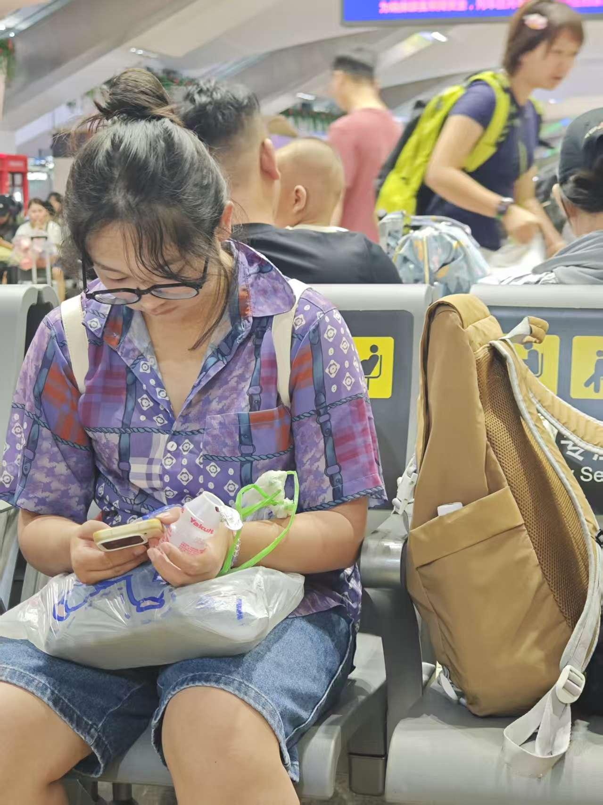
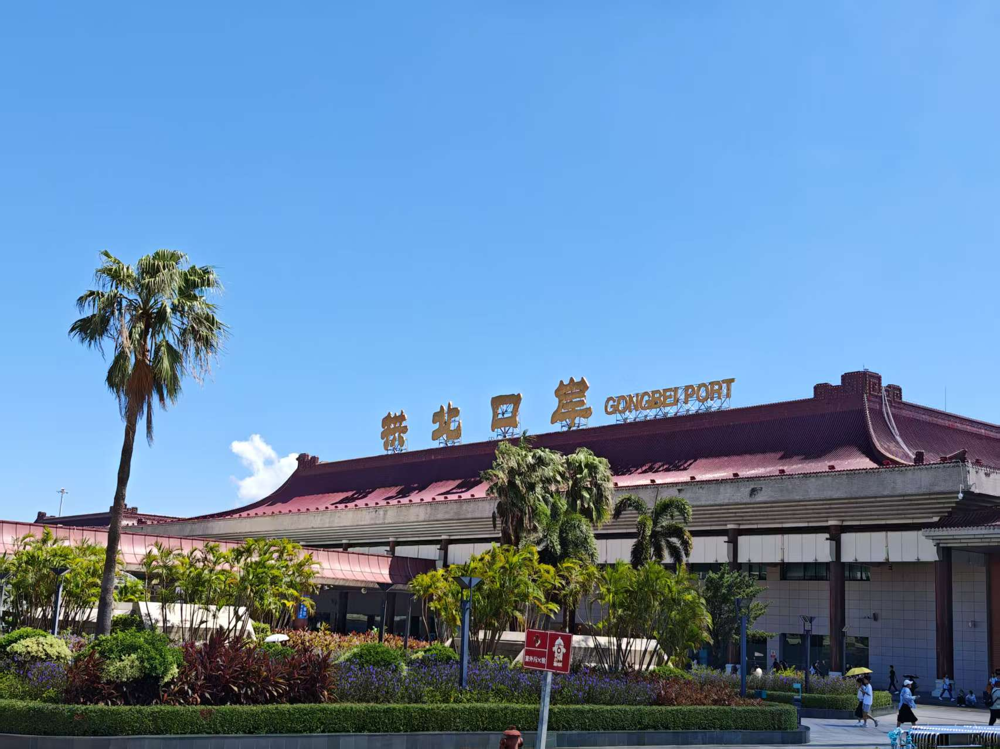
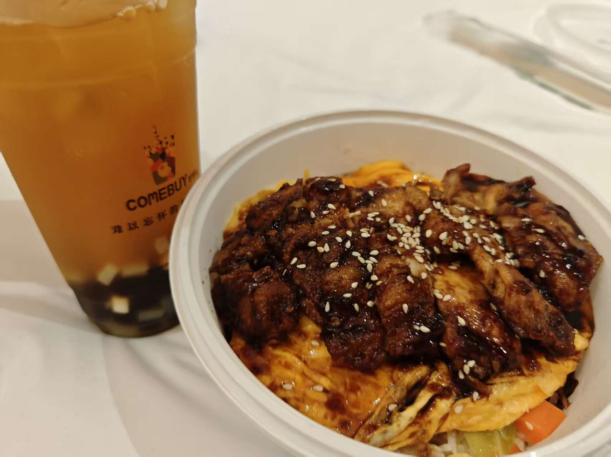
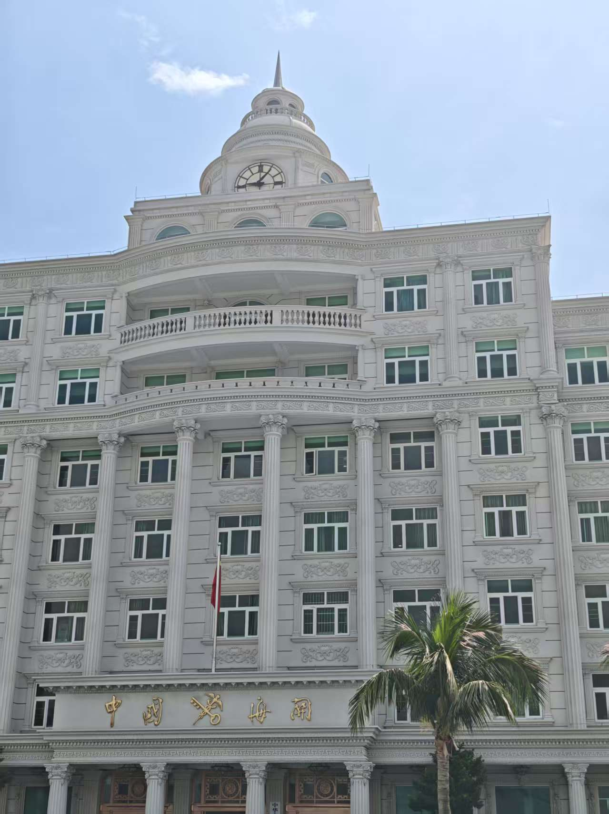
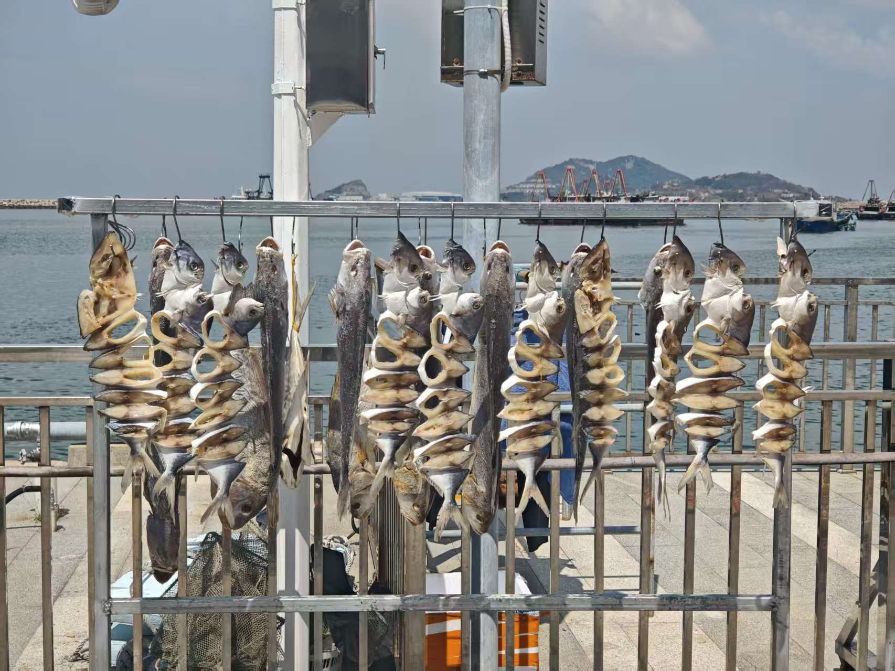
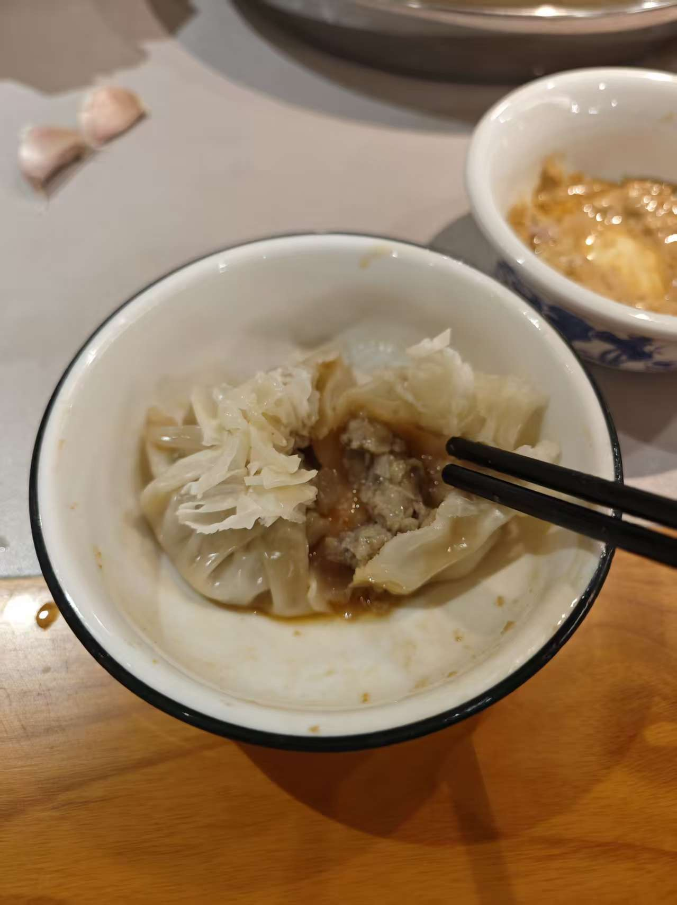
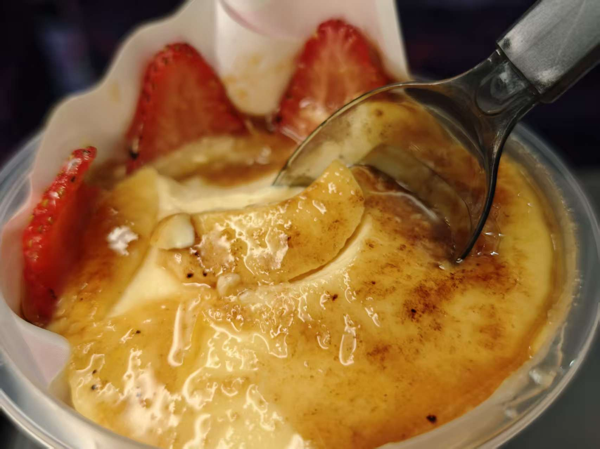

# 2025国庆假期计划
这次见面是字总到我这边，先做一个初步的计划，这几天下班后逐步完善细节

## 20251001计划
9：04 - 10：34 c302 元江到昆明
11:55 - 19：49 D3830 昆明到佛山西

!!! note 
    预计晚上8：40 能接字总回住处，去吃了东方广场的螺蛳粉

## 20251002计划
计划去看了广州塔，字总化妆到三点，还偷吃了我火锅味的粉面彩蛋

广州塔，天气很好，拍照很好看

这张是上次去广州塔拍到的，下雨天，感觉有些压抑

还看到了晚上的广州塔（我拍照感觉眼睛好小😂）

最后在广州塔附件的花城汇吃了肉蟹煲，很下饭，但感觉蟹已经是老员工了

## 20251003-20251004计划
原定是去阳江，最终考虑到天气，交通等因素，最终改去了珠海
等车的字总

差不多12点左右到珠海，住了照骗酒店（美团看着很大有很多栋楼，到现场发现是背景有很多栋楼），喝了粉条奶茶（没拍到照片，但粉条加在奶茶里真的好奇怪）  
珠海的公交很方便，但拱北站的公交站好难找，藏在负一楼

稍作休整后到了海滨公园玩了会沙子

看了日月贝，爱情邮局等小红书热门景点，真就是你不p，我不p，谁来带动GDP

晚上吃了捞汁海鲜，味道还不错

第二天去了桂山岛，去之前做了很多攻略，但没注意到海豚湾景点烂尾了，好在还有其他地方可以玩

因为拍照又吵了一架，哈哈哈

吃了海鲜面，不放辣椒感觉好腥

烂尾的海豚湾，对面就是香港，看起来像潮汐监狱

出了小金

去了海滨餐厅吃饭，偷拍了字总

离开珠海前路边随机吃了一家涮羊肉火锅，味道一般，但烧麦很好吃，我第一次知道烧麦里面可以是肉，不是糯米

吃到了真的菠萝包（这菠萝包叫真的菠萝包）

## 20251005计划
台风天，休息了一天

## 20251006计划
最终选择去了深圳逛了华强北感受了下全国最大的3c数码市场，去水贝买了珍珠项链，去深圳湾看了落日  
华强北旁边的达美乐，味道不错

切实感受到了改革开放的成果

拍了很多照片

吃了字总心心念念的鸡蛋仔

